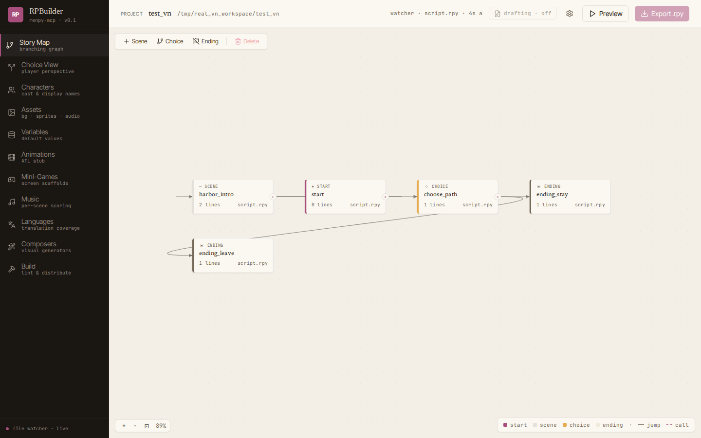
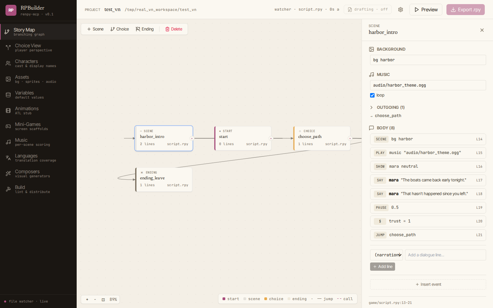
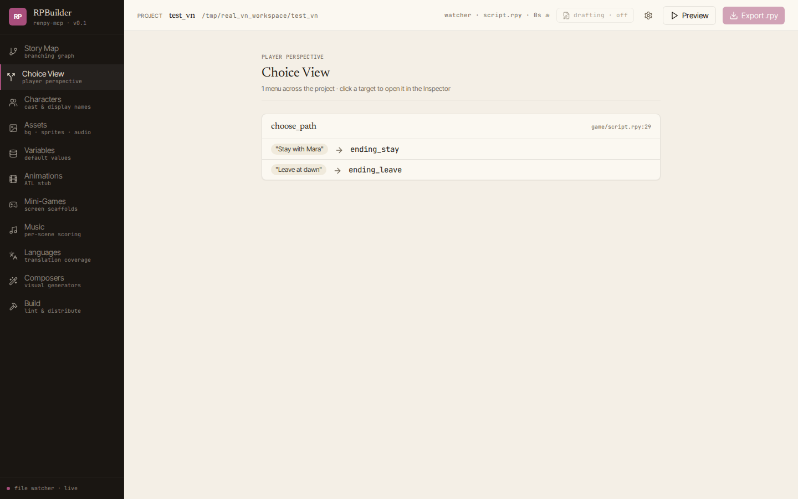
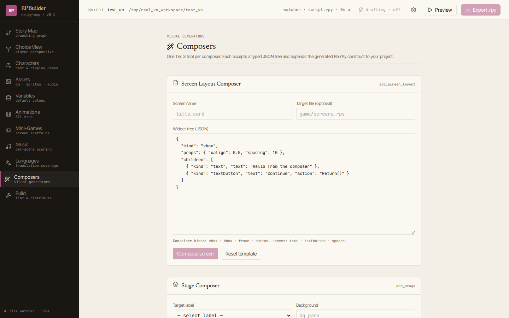
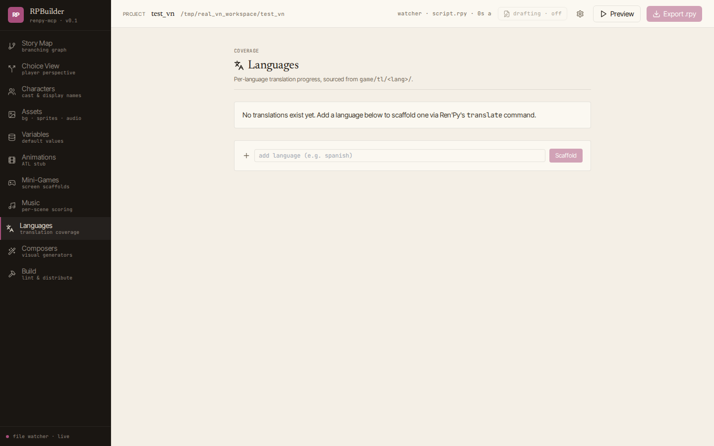
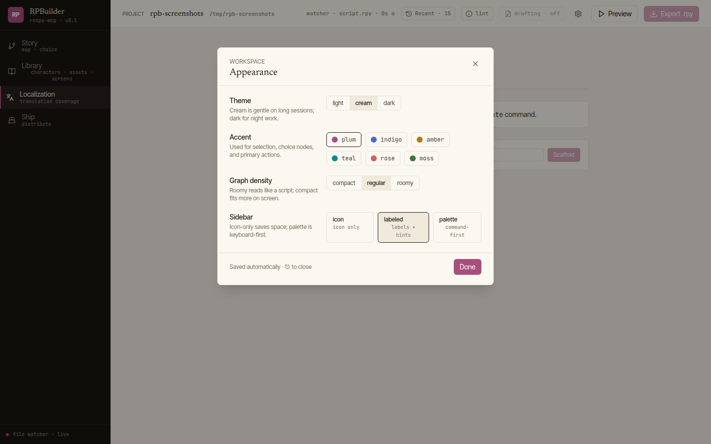

# renpy-mcp

**A toolkit for making visual novels — by hand, with a browser-based
editor, or with help from an AI assistant.**

[Ren'Py](https://www.renpy.org) is the engine that runs visual novels
like *Doki Doki Literature Club* and *Slay the Princess*. It's free
and open source, but its scripting language is intimidating if you've
never written code. This project exists so you don't have to.

There are three ways you can use it:

1. **Just the editor.** A browser-based GUI with a Story Map, Choice
   View, Scene Inspector, and visual Composers for screens, stages,
   and menus. Click around; edit dialogue; preview the game in
   Ren'Py. No AI, no command line.
2. **The editor + an AI helper.** Run the editor in one window, run
   an AI assistant (Claude Code, Cursor, hermes-agent) in another,
   both pointed at the same project. Tell the AI what scene you want;
   watch the GUI update as it edits.
3. **Pure AI assistant.** Skip the GUI; let the AI do everything in
   the terminal. Fastest path from "I have an idea for a visual
   novel" to "there's a runnable game I can play."

If options 2 or 3 sound foreign, see [QUICKSTART.md](QUICKSTART.md) —
it walks through "I've never used any of this" to "I can preview my
own VN" in about 15 minutes.

For the under-the-hood story (75 MCP tools, four tiers, a single
guarded write pipeline that keeps every edit lint-clean), keep reading.

## What it looks like

**Story Map** — every label in your project as a draggable card. Kind
badges (start / scene / choice / ending), drag-to-connect ports for
new edges, persisted positions. Built on native pointer events; no
React-Flow.



**Scene Inspector** — opens when you click any node. Renders the
label's ordered event stream (scene, play, show, say, pause, set,
jump, …) as typed cards, each with the source line number. The forms
at the top edit background / music / dialogue; the *Insert event*
button at the bottom drops in pause / setvar / show / with / flash
events.



**Choice View** — derived player perspective. Every top-level `menu:`
becomes a card listing its choices as pills with `if`-guard badges.
Click a target to jump back to its label in the Story Map.



**Composers** — visual generators for screens, multi-sprite stages,
imagemaps, and menus. Each composer takes a typed JSON tree and
appends one Ren'Py construct via the matching Tier 3 tool; agents
call the same tools directly.



**Languages** — per-language translation coverage from
`game/tl/<lang>/`. Click a row to load its stale-string list; the
"+ Scaffold" button runs `renpy.sh translate` to bootstrap a new
language.



**Themed shell** — three surface themes (light / cream / dark), six
accent presets, sidebar variants (icon / labeled / palette). Every
preference persists in `localStorage`.



> **LLM agents and fresh contributors:** start with [llms.txt](llms.txt) for
> an indexed source map, then [DESIGN.md](DESIGN.md) for the architecture,
> tier model, writer pipeline, and how to add a tool or panel safely.
> If you're producing or commissioning assets, [MEDIA.md](MEDIA.md)
> documents the formats, naming conventions, and VN-shaped style /
> tone direction that lets media drop in without rework.

---

## Install

**MCP server only** (the common case — wire it into Claude Code,
hermes-agent, Cursor, or any MCP client):

```bash
pip install git+https://github.com/fracturedring/renpy-mcp
renpy-mcp --sdk /path/to/renpy-sdk
```

`--project` is optional. When omitted, the server works against
`<cwd>/games/default/` and auto-scaffolds it on first run, so a fresh
conversation drops into a runnable starting state. Set `$RENPY_SDK`
instead of `--sdk` if you prefer. Agents should call `new_project` at
the start of a conversation to get their own named subfolder — see
[AGENTS.md](AGENTS.md) for the happy-path flow.

**With the RPBuilder GUI** (requires a repo checkout until the frontend
build ships with the wheel):

```bash
git clone https://github.com/fracturedring/renpy-mcp && cd renpy-mcp
gui/launch.sh                       # creates .venv, installs deps,
                                    # builds frontend, runs launcher
```

`gui/launch.sh` runs the **terminal launcher** that:

- scans your filesystem for a Ren'Py SDK (`~/renpy-sdk`,
  `~/Downloads/renpy-*-sdk`, `~/Desktop/`, `/opt/`, etc.) and offers
  the discovered ones,
- if none exist, offers to download the current SDK from renpy.org
  (with a progress bar) or to paste a path,
- maintains a recent-projects list with `<browse>` and `<new>` options,
- remembers both choices in `~/.config/renpy-mcp/launcher.json` (or
  `%APPDATA%` on Windows) so subsequent launches need at most a single
  Enter press.

After install you can also run `rpbuilder` directly from the activated
venv — same launcher. For the bare server without any picker, the
older `gui/run.sh /path/to/project /path/to/sdk` still works.

---

## Features

- **75 MCP tools across 4 tiers** (73 default + 2 opt-in) — reads,
  introspection, in-process diagnostics, lifecycle (preview / warp /
  drafting / translation scaffolding / distribute), guarded write
  primitives, high-level authoring intents (`new_project` scaffolds a
  runnable game in one call; composers stamp out screens, stages, and
  imagemaps from typed JSON trees), and opt-in escape hatches. Every
  tool description is tuned for small-model accuracy.
- **One-sentence-prompt friendly** — `new_project` + the Tier 3 intents
  are written so a low-tier model driving this server through a harness
  (hermes-agent, Claude Code) can turn a one-line premise into a
  runnable, distributable VN. See [AGENTS.md](AGENTS.md) for the
  playbook and `scripts/integration_drive.py` /
  `scripts/real_vn_drive.py` for end-to-end smoke tests.
- **Single guarded write pipeline** — every `.rpy` mutation (agent-
  driven or GUI-driven) routes through `apply_write`: path containment,
  cross-file label uniqueness, tab → 4-space normalization, atomic
  writes, `.rpyc` cleanup, unified diff in the response. Three
  documented exceptions (sidecar JSON files for canvas positions and
  diagnostic suppression, plus Ren'Py's own SDK-driven translation file
  emission) — see DESIGN.md §3.
- **In-process diagnostics complement `lint`** — `find_invalid_jumps`,
  `find_undefined_characters`, `find_unused_characters`,
  `find_missing_assets`, `find_undefined_screens`,
  `find_unreachable_labels`. Each shares a uniform response shape with
  per-rule suppression via `.renpy-mcp/ignored_diagnostics.json`. Cheap
  enough to call between every write.
- **RPBuilder browser GUI** — port-based editable Story Map with
  drag-to-rearrange, drag-to-connect, kind badges, and persisted
  positions; player-perspective Choice View; tree-driven Scene Inspector
  with typed event cards (say, scene, show, hide, play, stop, pause,
  jump, call, return, with, set, menu, if) and inline insert affordances
  for the five new event tools (pause, setvar, show, with-effect, flash);
  Characters; Assets; Variables; Music; Mini-Games; Languages
  (per-language coverage + stale-string list, with one-click
  `generate_translation_scaffolding`); Composers (Screen Layout, Stage,
  ImageMap, Menu); Build (lint + per-platform distribute). Theme tokens
  drive light / cream / dark surfaces × six accent presets, sidebar
  variants (icon / labeled / palette), preferences modal, ⌘K command
  palette spanning panels and labels. Watcher self-write suppression
  keeps the GUI from echoing the agent's own edits.
- **No chat panel in the GUI** — agent interaction happens in your
  existing LLM harness pointed at the same `renpy-mcp`. The file system
  is the integration point; the watcher fans filesystem events out to
  every connected WebSocket so the GUI stays live while the LLM edits.
- **Opt-in tiers** — `--tiers 1,2,3` is the default (reads + writes +
  intents); add `4` to unlock the escape hatches when the structured
  tools can't express what you need.

---

## Wiring it into an agent harness

### Claude Code

Drop a `.mcp.json` into any directory you open Claude Code from. Claude
auto-loads it on session start and exposes the tools as
`mcp__renpy__<tool_name>` (e.g. `mcp__renpy__list_labels`). A
[`.mcp.example.json`](.mcp.example.json) ships in this repo as a starting
point:

```json
{
  "mcpServers": {
    "renpy": {
      "type": "stdio",
      "command": "/path/to/renpy-mcp/.venv/bin/python",
      "args": [
        "-m", "renpy_mcp",
        "--sdk", "/path/to/renpy-sdk"
      ]
    }
  }
}
```

Add `"--project", "/path/to/specific/project"` if you want to pin the
session to an existing project; otherwise the server scaffolds
`<cwd>/games/default/` and the agent can call `new_project` to branch
into a named subfolder.

### hermes-agent

Uses the same `.mcp.json` shape; the harness reads it from
`~/.config/hermes-agent/mcp.json` or a project-local override. Tools show
up as `mcp_renpy_<tool_name>`. If you only want the high-level authoring
surface, filter to Tier 3 via harness-level include/exclude:

```json
"tools": {
  "include": [
    "mcp_renpy_new_project",
    "mcp_renpy_get_project_overview",
    "mcp_renpy_create_scene",
    "mcp_renpy_create_choice_node",
    "mcp_renpy_create_route",
    "mcp_renpy_add_dialogue_block",
    "mcp_renpy_add_character",
    "mcp_renpy_add_image_alias",
    "mcp_renpy_swap_background",
    "mcp_renpy_set_scene_music",
    "mcp_renpy_get_lint_report",
    "mcp_renpy_launch_preview"
  ]
}
```

Or load only specific tiers at the server level: `--tiers 1,3` excludes
Tier 2 entirely so small models see fewer overlapping options.

Image generation is **not** part of this server — hermes ships a fal
image tool built in. The flow is: hermes generates the PNG and writes
it to `<project>/game/images/<name>.png`, then calls
`mcp_renpy_add_image_alias` to register it. Same pattern for audio
(drop the file into `<project>/game/audio/`; music is referenced
directly by path in `play music` / `set_scene_music`).

### Cursor and other MCP clients

Anything that speaks MCP over stdio works — point it at
`renpy-mcp --project <p> --sdk <s>` and the tools register automatically.

---

## The RPBuilder GUI

Use `gui/run.sh <project> <sdk>` for production (builds the frontend on
first run and serves the SPA + API from a single FastAPI process on port
8765) or `gui/dev.sh <project> <sdk>` for a hot-reload backend + Vite dev
server. Both require a repo checkout — see the [Install](#install)
section above.

### Two demo scenarios

**Solo authoring (no LLM).** Open the GUI, build a scene visually in the
Story Map Inspector, hit Preview to play it. Every edit goes through
`renpy-mcp` so the underlying `.rpy` stays lint-clean and writer-guarded.

**LLM-assisted.** Run the GUI in one window and your LLM harness in another,
both pointed at the same project. Ask the LLM to "make Mei more sympathetic
in the cafe scene"; the file watcher pushes the change to the GUI's
WebSocket and the Story Map plus Inspector refresh live. Conversely, edits
made in the GUI become visible to the LLM on its next `read_character`
call. No explicit coordination — the file system is the integration point.

### Panel status

| Panel | State | What it does |
|---|---|---|
| Story Map | Working | Port-based editable graph (drag-to-rearrange, drag-to-connect, kind badges, persisted positions via `read_canvas_positions` / `set_canvas_positions`); toolbar adds Scene / Choice / Ending; Backspace deletes via `delete_label` with reference-aware refusal |
| Choice View | Working | Player-perspective derived filter — every top-level `menu:` rendered as choice pills + `if`-guard badges; click target → opens label in Inspector |
| Scene Inspector | Working | Right-docked panel; consumes `read_label_tree` and renders the full ordered event stream (say · scene · show · hide · play · stop · pause · jump · call · return · with · set · menu · if). Inline forms edit background / music / dialogue and insert any of the five Phase 4 events (pause, setvar, show, with-effect, flash) |
| Characters | Working | Card grid + edit drawer (`add_character` / `update_character`) |
| Assets | Working | Tabbed Backgrounds / Sprites / Music / SFX from `list_images` + `list_audio`; usage-count badges |
| Variables | Working | Table view; inline edit on `default` rows (`set_variable_default`); "+ New default" modal |
| Music | Working | Per-scene music table (joined from `list_audio` plays); inline edit via `set_scene_music`; music-library list |
| Mini-Games | Working | Lists scaffolded minigames (screen + label pairs); "+ New scaffold" modal calls `add_minigame_screen_scaffold` |
| Languages | Working | Per-language coverage bars from `get_translation_coverage`; click a row → stale-string list from `find_stale_translations`; "+ Scaffold" runs `generate_translation_scaffolding` |
| Composers | Working | Four sections in one panel: Screen Layout (JSON tree → `screen` block), Stage (label + bg + sprite rows + transition), ImageMap (ground + hover + hotspot rows), Menu (label + choice rows). Each calls its matching Tier 3 tool |
| Build | Working | `get_lint_report` runner with severity-coded findings + summary cards + raw-output viewer; Distribute section with per-platform target picker calling `build_distribution` |
| Preview button | Working | Header; toggles `launch_preview` / `stop_preview`; polls every 2s so external state changes (LLM-triggered) sync without refresh |
| Animations | Stub | Deliberate — Ren'Py's ATL doesn't fit a multi-track timeline cleanly |

### Themed shell

Three surface themes (light / cream / dark) × six accent presets,
sidebar variants (`icon` / `labeled` / `palette`), preferences modal,
⌘K command palette. All driven by CSS variables in `theme.css`;
preferences persist in `localStorage`.

---

# For contributors

Everything below is for people extending this codebase — either the MCP
server, a GUI panel, or the tests. If that's not you, stop reading here;
the sections above are the complete user surface.

The shortest contributor onboarding lives in
[CONTRIBUTING.md](CONTRIBUTING.md): where new code goes per tier, the
non-negotiable invariants, testing patterns, and how to run the
end-to-end smoke probes.

## Status

Alpha. **75 MCP tools** (73 default + 2 opt-in), **329 tests** passing in
~9 seconds. End-to-end smoke probes:
`scripts/integration_drive.py` (40-step in-process drive: scaffold →
author → diagnose → warp → translate → distribute) and
`scripts/real_vn_drive.py` (drives a project that ships fal-generated
assets all the way to a real `<name>-<version>-pc.zip`). The tier model,
writer pipeline, and GUI architecture are stable; tool schemas may
still shift in minor ways.

## Architecture at a glance

- **MCP server** (`src/renpy_mcp/`) — tiered tool registry + one guarded
  write pipeline (`apply_write` in `project/writer.py`). Every mutation
  routes through it regardless of tier.
- **Project index** (`project/scanner.py`) — pragmatic regex scanner that
  surfaces labels, characters, images, audio, screens, variables,
  transforms. Refreshed after every write.
- **Guardrails** (`guardrails/`) — indent normalization, reserved-name
  checks, label-uniqueness checks, dialogue escaping. Pure functions;
  reused across tiers.
- **RPBuilder GUI** (`gui/`) — single FastAPI process spawns its own
  `renpy-mcp` stdio subprocess plus a watchdog observer that fans
  filesystem events out to WebSocket clients. REST endpoints are thin
  wrappers around MCP tool calls.

Deep dive in [DESIGN.md](DESIGN.md).

## Tier breakdown

- **Tier 1** (default on) — 26 read tools (introspection, structured
  label-tree read, choice graph, translation coverage, in-process
  diagnostics with sidecar suppression) + 7 lifecycle tools
  (`launch_preview`, `stop_preview`, `get_preview_status`, `warp_to`,
  `set_drafting_mode`, `generate_translation_scaffolding`,
  `build_distribution`). Lifecycle tools spawn the Ren'Py SDK; the
  reads never do.
- **Tier 2** (default on) — 26 guarded write primitives. One Ren'Py
  construct per tool. Right layer for precise diffs. Includes the
  Phase 4 event tools (`add_pause`, `add_setvar`, `add_show`,
  `add_with_effect`, `add_flash`) that the Inspector's insert-event
  popup wires up, plus `add_menu` and `add_condition_branch` (the
  if/elif/else block primitive — single Ren'Py construct, single
  `apply_write` call).
- **Tier 3** (default on) — 14 high-level authoring intents, including
  `new_project` (scaffolds a runnable skeleton and rebinds the session)
  and the three composer tools (`add_screen_layout`, `add_stage`,
  `add_imagemap`). The Menu Composer panel calls the Tier 2 `add_menu`
  primitive directly — it is a single-construct emit, not a true
  composition. Composes multiple Tier 2 writes when the intent calls
  for it; the primary surface for agents.
- **Tier 4** (opt-in) — 2 escape hatches: `apply_unified_diff` (strict
  context-match diff applier; supports creation, refuses deletion) and
  `exec_python_in_init` (ast-validated `init python:` block appender).
  Can touch arbitrary file content — that's the point.

Configure with `--tiers 1,2,3,4` (default `1,2,3`). See §2 of
[DESIGN.md](DESIGN.md#2-the-tiered-tool-model) for how to pick a tier
when adding a tool.

## Tool naming convention

- `snake_case`; action-first for writes (`add_say`, `swap_background`),
  noun-first for reads (`list_labels`, `read_label`).
- No `renpy_` prefix — the harness already namespaces tools as
  `mcp_<server>_<tool>`. Doubling up wastes characters in tool names
  that small models have to attend to.
- Stay <=25 chars where possible.
- Descriptions are written for small-model accuracy: terse, exact,
  one-line where feasible, extra paragraphs only for non-obvious
  constraints.

## Development

```bash
git clone https://github.com/fracturedring/renpy-mcp
cd renpy-mcp
python3 -m venv .venv && source .venv/bin/activate
pip install -e ".[dev,gui]"

# MCP server tests
pytest -q

# Frontend production build
cd gui/frontend && npm install && npm run build
```

The test suite takes ~9 seconds. Some tests (`test_gui_backend.py`,
anything calling `get_lint_report`) are module-skipped when `RENPY_SDK`
is not set — that's expected locally without the SDK; they run in full
when `RENPY_SDK` points at a Ren'Py install.

Smoke test against the fixture project:

```bash
python scripts/smoke_test.py \
  --project tests/fixtures/tiny_project \
  --sdk $RENPY_SDK
```

## Directory layout

```
src/renpy_mcp/               # the MCP server
  tools/
    tier1_read.py            # reads + lint + diagnostics (26 tools)
    lifecycle.py             # preview / warp / drafting / build (7 tools)
    tier2_write.py           # guarded write primitives (26 tools)
    tier3_intents.py         # high-level intents (14 tools)
    tier4_escape.py          # escape hatches (2 tools, opt-in)
    _shared.py               # helpers reused across tiers
    registry.py              # single dispatch point
  project/
    writer.py                # THE write pipeline — every mutation passes through
    scanner.py               # project index (labels, chars, images, …)
  guardrails/                # pure defensive helpers
  server.py                  # MCP server + tier registration
  config.py                  # ServerConfig + DEFAULT_TIERS

gui/                         # browser-based editor
  backend/src/renpy_mcp_gui/
    app.py                   # FastAPI REST + WebSocket
    mcp_client.py            # stdio MCP subprocess client
    watcher.py               # watchdog observer → WebSocket fan-out
  frontend/src/
    panels/                  # one component per left-rail panel
    api/                     # fetch wrapper + shared types
    layout/                  # Sidebar, Header
  run.sh                     # production entrypoint (builds on first run)
  dev.sh                     # hot-reload: backend + Vite dev server

tests/
  fixtures/tiny_project/     # canonical fixture — copied into tmp_path per test
  conftest.py                # FIXTURE_ROOT, SDK_ROOT, parse(), default fixtures
  test_tier1.py … test_tier4.py
  test_gui_backend.py        # SDK-gated; FastAPI TestClient end-to-end
  test_lifecycle.py          # preview spawn / stop with subprocess mocked

scripts/
  smoke_test.py              # end-to-end sanity probe

llms.txt                     # indexed source map for LLM agents
DESIGN.md                    # architecture deep-dive
README.md                    # this file
```

## Adding a new tool

Short version:

1. Pick a tier (see [DESIGN §2](DESIGN.md#2-the-tiered-tool-model)).
2. Add a `_my_tool(config, index) -> ToolDef` factory to
   `tools/tierN_*.py` with a JSON-schema `input_schema`
   (`additionalProperties: False`, explicit `required` list).
3. Build new content in the handler, then call `apply_write` via
   `write_response` from `_shared.py`. Catch `WriteRejected` and return
   `err(...)`.
4. Register the tool in the tier's `register()` function.
5. Add happy-path + rejection tests in `tests/test_tierN.py`, using the
   `workspace` fixture (copies the fixture project into `tmp_path`).
6. If the GUI should expose it, add a thin FastAPI endpoint in
   `gui/backend/src/renpy_mcp_gui/app.py` (module-scope Pydantic body
   model) and wire it into a panel.

Longer version with rationale: [DESIGN §6](DESIGN.md#6-adding-a-new-tool-step-by-step).

## Non-goals (what this repo explicitly does NOT do)

- Animations panel — Ren'Py's ATL doesn't fit a multi-track timeline.
- Chat panel inside the GUI — adding one breaks the single-integration-
  point model (the file system).
- Authoritative Ren'Py parse — `ProjectIndex` is a pragmatic scanner,
  not a parser. For true syntactic reasoning, call Ren'Py via
  `get_lint_report`.
- File deletion via `apply_unified_diff` — out of scope; will land as
  its own tool when needed.

Full rationale in [DESIGN §10](DESIGN.md#10-non-goals-what-this-repo-explicitly-does-not-do).

## License

AGPL-3.0-or-later — see [LICENSE](LICENSE).

The project relicensed from MIT to AGPL-3.0 in commit-after-`c728830` to
enable code-level adaptation from AGPL-licensed Ren'Py IDEs (notably
[bluemoonfoundry/bmf-vangard-renpy-ide](https://github.com/bluemoonfoundry/bmf-vangard-renpy-ide)).
Snapshots taken before that commit remain MIT-licensed.

**What AGPL means in practice for users:**

- Forks and modifications must stay AGPL-3.0-or-later.
- The §13 network clause applies to the GUI: anyone who runs the GUI as
  a hosted service for users beyond themselves must offer the
  corresponding source to those users.
- MCP harnesses (Claude Code, hermes-agent, Cursor) communicate with the
  server over stdio as separate processes. They are not derivative
  works of the server merely by calling its tools.
